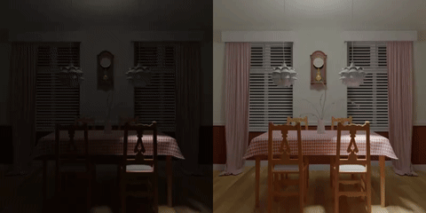
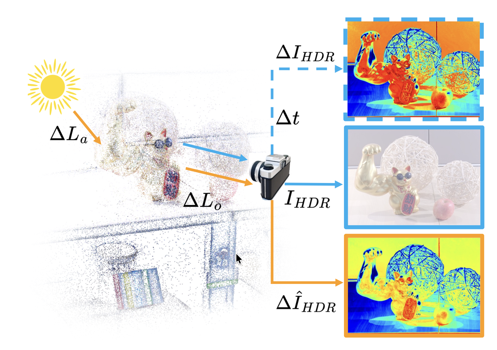
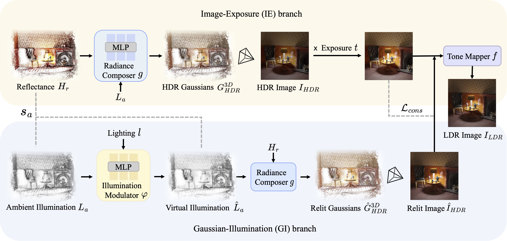
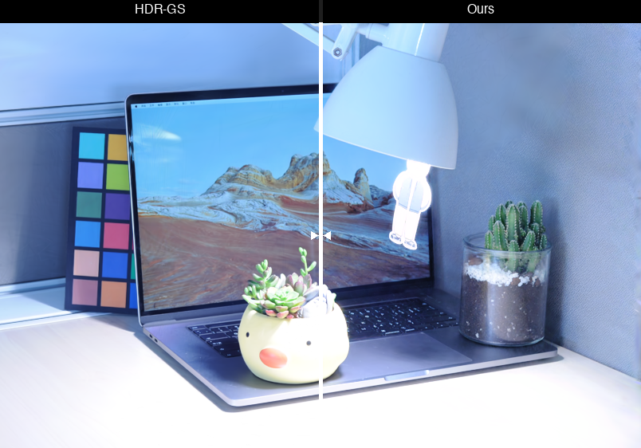
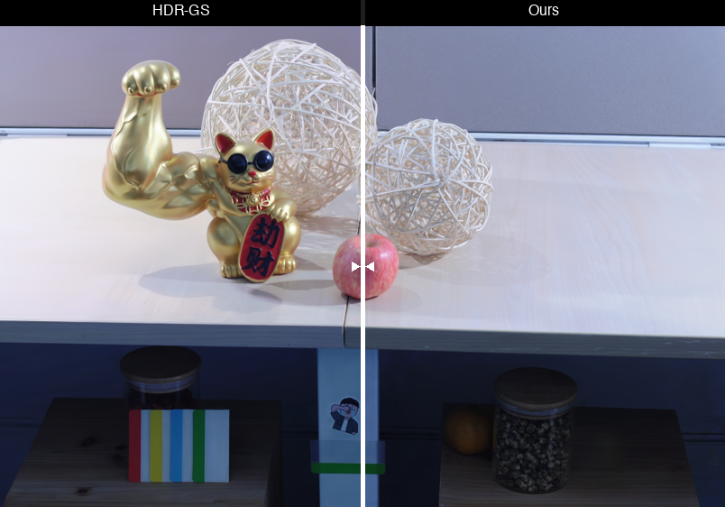
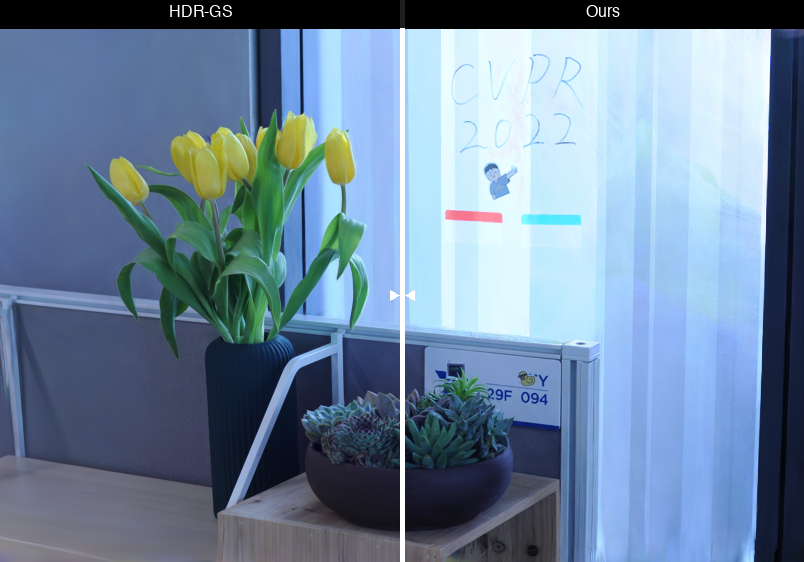
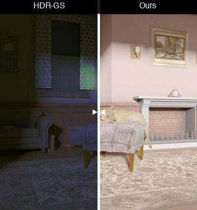
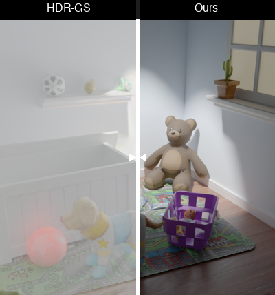
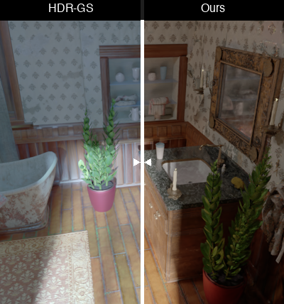

<div align="center">

# Physically Inspired Gaussian Splatting for HDR Novel View Synthesis

</div>

<div align="center">

**CVPR 2026**

<a href="https://huimin-zeng.github.io/PhysHDR-GS/assets/paper.pdf"></a>
<a href="https://huimin-zeng.github.io/PhysHDR-GS/assets/supp.pdf"></a>
<a href="https://arxiv.org/abs/2603.28020"></a>
<a href="https://huimin-zeng.github.io/PhysHDR-GS/"></a>

[Huimin Zeng](https://huimin-zeng.github.io/), [Yue Bai](https://yueb17.github.io/), [Hailing Wang](https://scholar.google.com/citations?user=oKoYjqUAAAAJ&hl=zh-CN), [Yun Fu](https://www1.ece.neu.edu/~yunfu/)

Northeastern University

</div>


<table>
  <tr>
    <td align="center" width="50%"><b>Bathroom</b></td>
    <td align="center" width="50%"><b>Chair</b></td>
  </tr>
  <tr>
    <td></td>
    <td></td>
  </tr>
  <tr>
    <td align="center"><b>Sofa</b></td>
    <td align="center"><b>Diningroom</b></td>
  </tr>
  <tr>
    <td></td>
    <td></td>
  </tr>
  <tr>
    <td align="center"><b>Dog</b></td>
    <td align="center"><b>Bear</b></td>
  </tr>
  <tr>
    <td></td>
    <td></td>
  </tr>
</table>


## Overview
 

**PhysHDR-GS** models scene appearance via intrinsic reflectance and adjustable ambient illumination.

**Key Features:**
- ✅ Physically inspired dual-branch design (IE + GI branch)
- ✅ Explicit HDR self-supervision without ground truth
- ✅ Reducing exposure-biased gradient starvation
- ✅ Real-time rendering speed (up to 76 FPS)


<div align="center">



</div>

## Comparison with SOTA
### Want to drag the slider? Visit our [project page](https://huimin-zeng.github.io/PhysHDR-GS/) for the full interactive comparison. 😄

### LDR Comparison

<table>
  <tr>
    <td align="center" width="33%"><b>Computer</b></td>
    <td align="center" width="33%"><b>Luckycat</b></td>
    <td align="center" width="33%"><b>Flower</b></td>
  </tr>
  <tr>
    <td></td>
    <td></td>
    <td></td>
  </tr>
</table>

### HDR Comparison

<table>
  <tr>
    <td align="center" width="33%"><b>Sofa</b></td>
    <td align="center" width="33%"><b>Bear</b></td>
    <td align="center" width="33%"><b>Bathroom</b></td>
  </tr>
  <tr>
    <td></td>
    <td></td>
    <td></td>
  </tr>
</table>


## Preparation

### Requirements

- Python 3.10
- CUDA 12.1 or later
- PyTorch 2.1.2 (with CUDA 12.1 support)
- torchvision 0.16.2
- pytorch-lightning 1.4.2

#### Option 1: Docker (Recommended)

We provide a Docker image environment for easy setup:

```bash
docker pull zeldam1/zhm_docker:zhm-py310-torch21
docker run --gpus all -it -v /workdir:/workdir  --shm-size 64g zeldam1/zhm_docker:zhm-py310-torch21 /bin/bash

git clone https://github.com/ZeldaM1/PhysHDR-GS.git
cd PhysHDR-GS

pip install pyiqa==0.1.10 pytorch-lightning==1.4.2 torchmetrics==0.6.0 taming-transformers-rom1504 scikit-learn kornia==0.6 open_clip_torch==2.0.2 transformers==4.38.2 clip accelerate==1.12.0 submodules/simple-knn submodules/diff-gaussian-rasterization
```

#### Option 2: Conda Environment

```bash
# Clone the repository
git clone https://github.com/ZeldaM1/PhysHDR-GS.git
cd PhysHDR-GS

# Create conda environment
conda create -y -n PhysHDR-GS python=3.10
conda activate PhysHDR-GS

# Install PyTorch with CUDA 12.1
pip install torch==2.1.2 torchvision==0.16.2 torchaudio==2.1.2 --index-url https://download.pytorch.org/whl/cu121


# Install other dependencies
pip install pytorch-lightning==1.4.2 torchmetrics==0.6.0 open-clip-torch==2.0.2
pip install pyiqa==0.1.10 taming-transformers-rom1504 scikit-learn kornia==0.6 transformers==4.38.2 clip accelerate==1.12.0

# Install submodules
pip install submodules/diff-gaussian-rasterization
pip install submodules/simple-knn
```

## TODO
* [x] Environment  
* [ ] Dataset preparation  
* [ ] Code releasing 


## Citation

If you find this work useful, please give us a star 🌟 and consider citing our paper:

```bibtex
@misc{zeng2026physicallyinspiredgaussiansplatting,
      title={Physically Inspired Gaussian Splatting for HDR Novel View Synthesis}, 
      author={Huimin Zeng and Yue Bai and Hailing Wang and Yun Fu},
      year={2026},
      eprint={2603.28020},
      archivePrefix={arXiv},
      primaryClass={cs.CV},
      url={https://arxiv.org/abs/2603.28020}, 
}
```


## Acknowledgments
This repository builds upon excellent prior work:
- [3D Gaussian Splatting](https://github.com/graphdeco-inria/gaussian-splatting) by Kerbl et al.
- [GaussHDR](https://github.com/LiuJF1226/GaussHDR) by Liu et al.

We thank their authors for sharing these excellent works!


## License

This project is licensed under the [MIT License](LICENSE).


## Contact

For questions and issues, please open an issue on GitHub or contact zeng.huim@northeastern.edu.

